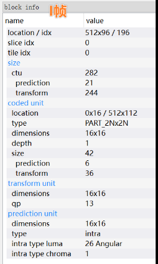
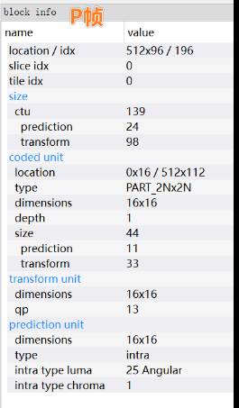

# 2024-Codec资料速查

# 2024-05 Lighthawk@126.com

## 1、Hevc的I帧intra和P帧intra

| 举例：StreamEye v4.0.47568                                   |                                                              |
| ------------------------------------------------------------ | ------------------------------------------------------------ |
|  | 码流中可能会写入如下标记： 1、split_cu_flag 2、prev_intra_luma_pred_flag 3、rem_intra_luma_pred_mode 4、intra_chroma_pred_mode |
|  | 码流中可能会写入如下标记： 1、split_cu_flag 2、cu_skip_flag 3、pred_mode_flag 4、prev_intra_luma_pred_flag 5、rem_intra_luma_pred_mode 6、intra_chroma_pred_mode |

## 2、avs3协议

> https://github.com/uavs3/uavs3e
>
> https://github.com/uavs3/uavs3d

## 3、推荐的杂记博客

> 【飞翔的博客】https://soaringleefighting.github.io
>
> 技术与读书笔记都有，整理的使用规整，也比较有趣

## 4、可下载的视频数据源

> [YUV Sequences (asu.edu)](http://trace.eas.asu.edu/yuv/index.html)
>
> [Xiph.org :: Derf's Test Media Collection](https://media.xiph.org/video/derf/)
