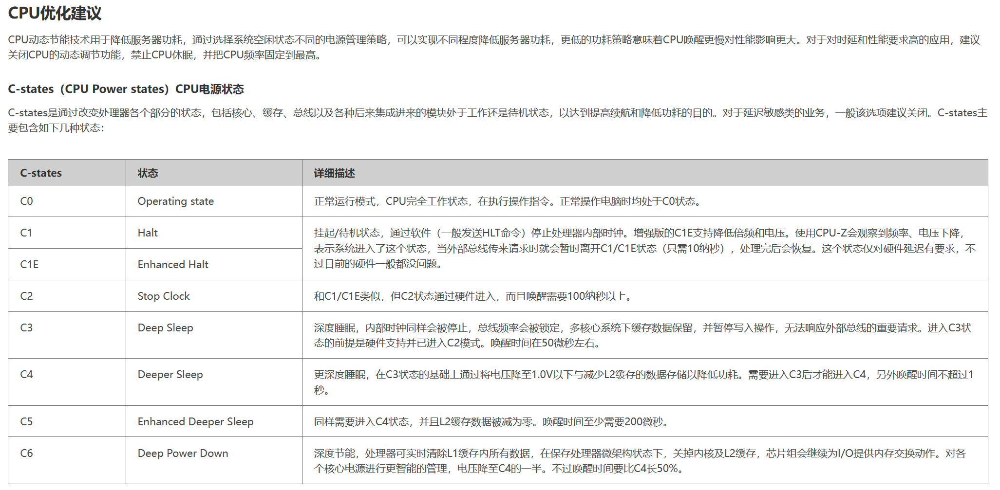

# cpu性能查看

### ubuntu 可以安装 cpufreq
```shell
# 参考博客：https://blog.csdn.net/yzqlyzql/article/details/120719069
apt-get install cpufrequtils

# 查看 cpufreq-info
cpufreq-info

# 更改当前 cpu 策略
# 通常策略模式有5种，分别是powersave, userspace, ondemand, conservative, performance，可以在cpufreq-info中查看自己的CPU支持哪几种控制模式，下面的例子是如何将CPU频率控制策略变更为powersave模式：
cpufreq-set -g powersave

# 更改 cpu 频率：
cpufreq-set -d 1200000 -u 2800000      // 适用模式：powersave|ondemand|conservative|performance
cpufreq-set -f {1800000~2800000}       // 适用模式：userspace
cpufreq-set -f 2200000                 // 适用模式：userspace
```

### euler 可以安装 cpupower
```shell
yum install kernel-tools kernel-rt-tools

# 命令
cpupower infor
Usage:  cpupower [-d|--debug] [-c|--cpu cpulist ] <command> [<args>]
Supported commands are:
        frequency-info
        frequency-set
        idle-info
        idle-set
        set
        info
        monitor
        help
# 租用hwcloud
cpupower frequency-info
analyzing CPU 0:
  driver: cppc_cpufreq
  CPUs which run at the same hardware frequency: 0 1 2 3
  CPUs which need to have their frequency coordinated by software: 0 1 2 3
  maximum transition latency:  Cannot determine or is not supported.
  hardware limits: 2.40 GHz - 2.40 GHz
  available cpufreq governors: conservative ondemand userspace powersave performance schedutil
  current policy: frequency should be within 2.40 GHz and 2.40 GHz.
                  The governor "performance" may decide which speed to use
                  within this range.
  current CPU frequency: 2.40 GHz (asserted by call to hardware)
# 家里的 x86_64
cpupower frequency-info
analyzing CPU 0:
  driver: intel_cpufreq
  CPUs which run at the same hardware frequency: 0
  CPUs which need to have their frequency coordinated by software: 0
  maximum transition latency: 20.0 us
  hardware limits: 1.20 GHz - 3.00 GHz
  available cpufreq governors: conservative ondemand userspace powersave performance schedutil
  current policy: frequency should be within 3.00 GHz and 3.00 GHz.
                  The governor "performance" may decide which speed to use
                  within this range.
  current CPU frequency: Unable to call hardware
  current CPU frequency: 2.21 GHz (asserted by call to kernel)
  boost state support:
    Supported: yes
    Active: yes

# 后来好奇，运行了下 cpupower idle-info，出发了知识盲区，就顺便补了下
cpupower  idle-info
CPUidle driver: intel_idle
CPUidle governor: menu
analyzing CPU 0:

Number of idle states: 5
Available idle states: POLL C1 C1E C3 C6
POLL:
Flags/Description: CPUIDLE CORE POLL IDLE
Latency: 0
Usage: 6565
Duration: 29630
C1:
Flags/Description: MWAIT 0x00
Latency: 2
Usage: 27635
Duration: 4138960
C1E:
Flags/Description: MWAIT 0x01
Latency: 10
Usage: 434740
Duration: 92667162179
C3 (DISABLED) :
Flags/Description: MWAIT 0x10
Latency: 40
Usage: 0
Duration: 0
C6 (DISABLED) :
Flags/Description: MWAIT 0x20
Latency: 133
Usage: 0
Duration: 0

# idle states: POLL C1 C1E C3 C6 含义
```
【RH8100 V3服务器 性能优化最佳实践 02】https://support.huawei.com/enterprise/zh/doc/EDOC1000117210/b454301f



### 通用方法
```shell
cat /proc/cpuinfo
cat /proc/cpuinfo | grep MHz
```