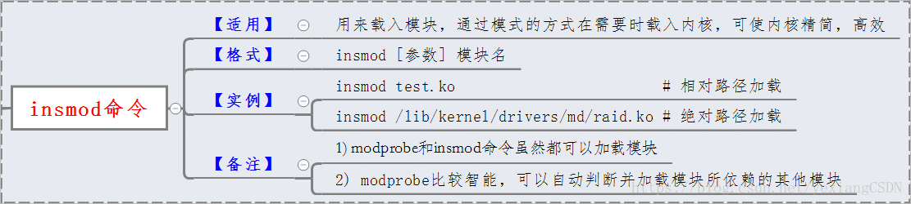
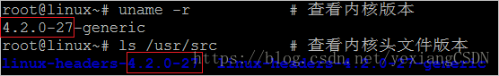

# insmod命令

# 2024-05-02 Lighthawk

## 参考资料

> [Linux 系统设置 : insmod 命令详解_linx如何进入insmod-CSDN博客](https://blog.csdn.net/yexiangCSDN/article/details/82828055) 【目前我还是小白一枚，下面摘自这篇】

## 语法和选项

```shell
insmod [option] [params(kernel modules)]

-f：不检查目前kernel版本与模块编译时的kernel版本是否一致，强制将模块载入；
-k：将模块设置为自动卸除；
-m：输出模块的载入信息；
-o<模块名称>：指定模块的名称，可使用模块文件的文件名；
-p：测试模块是否能正确地载入kernel；
-s：将所有信息记录在系统记录文件中；
-v：执行时显示详细的信息；
-x：不要汇出模块的外部符号；
-X：汇出模块所有的外部符号，此为预设置。
```

## insmod 命令作用

静态加载就是把驱动程序直接编译进内核，系统启动后可以直接调用。静态加载的缺点是调试起来比较麻烦，每次修改一个地方都要重新编译和下载内核，效率较低。若采用静态加载的驱动较多，会导致内核容量很大，浪费存储空间。

**动态加载**利用了Linux的module特性，可以在系统启动后用insmod命令添加模块（.ko），在不需要的时候用rmmod命令卸载模块，采用这种动态加载的方式便于驱动程序的调试，同时可以针对产品的功能需求，进行内核的裁剪，将不需要的驱动去除，大大减小了内核的存储容量。



**【insmod与modprobe命令】**

在Linux中，modprobe和insmod都可以用来加载module，不过现在一般都推荐使用modprobe而不是insmod了。 modprobe和insmod的区别是什么呢？

1) modprobe可以解决load module时的依赖关系，比如load moudleA就必须先load mouduleB之类的，它是通过/lib/modules//modules.dep文件来查找依赖关系的。而insmod不能解决依赖问题。

2) modprobe默认会去/lib/modules/目录下面查找module，而insmod只在给它的参数中去找module（默认在当前目录找）。 这样，有时insmod也有它的有用之处，举个例子吧。

有/root/my-mod.ko这个module，cd /root/，然后用insmod my-mod.ko(insmod /root/my-mod.ko)就可以insert这个module了，但是用modprobe my-mod.ko(modprobe /root/my-mod.ko)却提示"FATAL: Module my-mod.ko not found"，这就是因为modprobe是到/lib/modules/`uname -r`/下去找module的，如果没找到就是这样了。

**【检查Linux内核】**

安装前要检查内核版本和内核头文件版本是否一致，否则报错



由此可见内核版本和内核头文件版本是一致的，都是4.2.0-27。

如果不一致的话在insmod一步必定出错：Error inserting './hello.ko': -1 Invalid module format 

