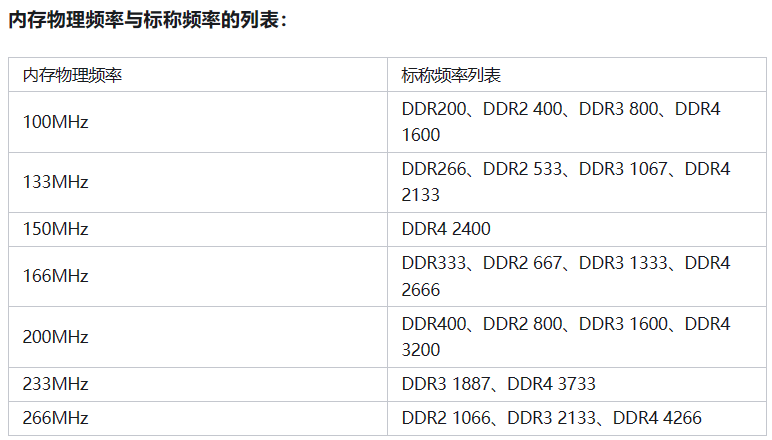
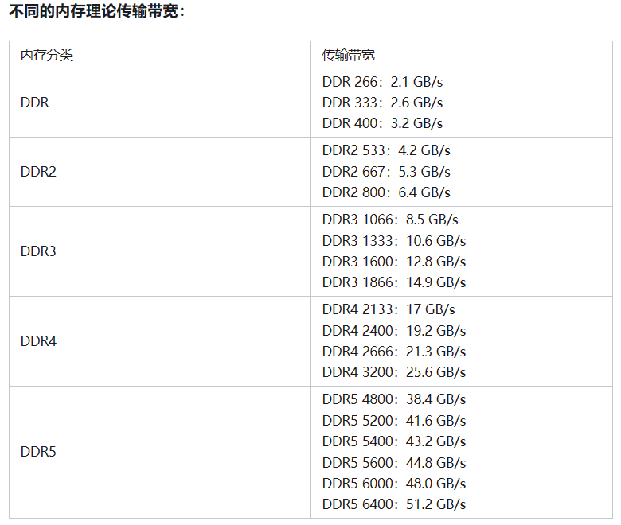
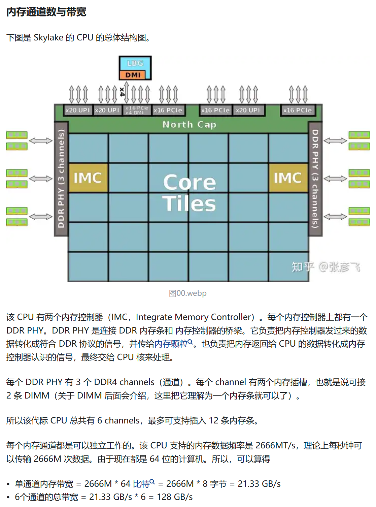
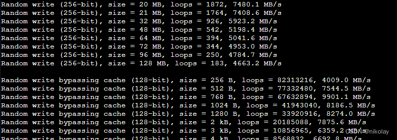
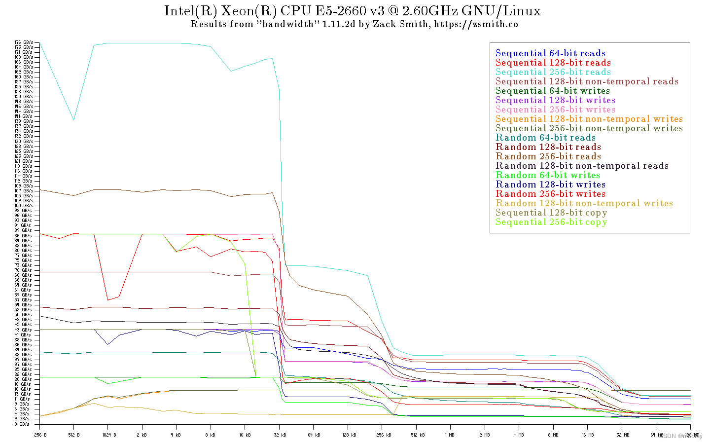

# System Memory

# 2024-05-03 Lighthawk

## 参考资料

> [内存条带宽的换算方法、DDR4内存理论带宽以及目前的内存标准（JEDEC标准及XMP标准） - 知乎 (zhihu.com)](https://zhuanlan.zhihu.com/p/443104177)
>
> [(32 封私信 / 34 条消息) linux服务器配置如何计算，CPU、带宽、内存、硬盘容量？ - 知乎 (zhihu.com)](https://www.zhihu.com/question/286782871)
>
> [Linux内存带宽的一些测试笔记](https://blog.csdn.net/tiandekuan/article/details/78835262)
>
> [Linux系统性能测试工具（一）——内存带宽测试工具mbw - 小嘉欣 - 博客园 (cnblogs.com)](https://www.cnblogs.com/sunshine-blog/p/11903842.html)
>
> [使用Bandwidth测试服务器的内存带宽(memory bandwidth)-CSDN博客](https://blog.csdn.net/nikolay/article/details/128482194)
>
> [如何在 Linux 上使用 Dmidecode 命令获取硬件信息 (linux-console.net)](https://cn.linux-console.net/?p=2389)

## 内存频率和内存带宽

> 内存带宽 = 内存核心频率 x 倍增系数 x (内存总线位数 / 8)
>
> 通用公式：带宽 = 频率 x 位宽 / 8
>
> 倍增系数：DDR2 -> 2^2，DDR3 -> 2^3
>
> 每个内存通道通常可以插两根内存条
>
> 【单通道】内存带宽的计算公式是：带宽=内存核心频率×内存总线位数×倍增系数。简化公式为：标称频率*位数。比如一条DDR3 1333MHz 64bit的内存，理论带宽为：1333 x 64/8=10664MiB/s = 10.6GiB/s。
>
> 【多通道】带宽 = 单通道带宽 x 通道数

> 而内存名称上的数字则是标称频率，其实并不是物理频率。如 DDR 400、DDR2 800、DDR3 1600 和 DDR4 3200 的物理运行频率都是 200MHz，物理频率必须乘上倍增系数才能获得相应的标称频率。标称频率是以老旧的 SDRAM 内存为基准，换算得出利于商业运作和产品标识的频率





## 内存通道



## 内存检测工具

### 0、OS自带工具 dmidecode

- 实操博客：[如何在 Linux 上使用 Dmidecode 命令获取硬件信息 (linux-console.net)](https://cn.linux-console.net/?p=2389)

```shell
# 只截取了一条内存的信息：

dmidecode -t memory

# dmidecode 3.4
Getting SMBIOS data from sysfs.
SMBIOS 3.0.0 present.

Handle 0x0056, DMI type 16, 23 bytes
Physical Memory Array
        Location: System Board Or Motherboard
        Use: System Memory
        Error Correction Type: Multi-bit ECC			# 服务器内存，带纠错功能
        Maximum Capacity: 384 GB
        Error Information Handle: Not Provided
        Number Of Devices: 6
Handle 0x005B, DMI type 17, 40 bytes
Memory Device
        Array Handle: 0x0056
        Error Information Handle: Not Provided
        Total Width: 72 bits
        Data Width: 72 bits								# 数据带宽 72 bit
        Size: 16 GB
        Form Factor: DIMM
        Set: None
        Locator: DIMM_B1
        Bank Locator: NODE 1
        Type: DDR3
        Type Detail: Synchronous
        Speed: 1600 MT/s					
        Manufacturer: Samsung
        Serial Number: 122608D4
        Asset Tag: DIMM_B1_AssetTag
        Part Number: M393B2G70QH0-YK0  
        Rank: 2
        Configured Memory Speed: 1600 MT/s				# 每秒以 1600MT/s速度传输 72 bit
        Minimum Voltage: Unknown
        Maximum Voltage: Unknown
        Configured Voltage: Unknown
```

> 重点关注信息：
>
> Configured Memory Speed: 1600 MT/s	 # 每秒以 1600MT/s速度传输 72 bit
>
> Data Width: 72 bits			# 数据带宽 72 bit
>
> 可以计算出，该物理内存理论传输带宽：
>
> 72 / 8 x 1600M = 14400MiB = 14.4GB
>
> 不过。。。这篇博客中[Linux 内存带宽对进程性能影响 - 知乎 (zhihu.com)](https://zhuanlan.zhihu.com/p/367004094)，虽然这样计算没有错，但最后写到了“插了两个内存条，所以内存带宽上线是带宽x2”，与其他资料看到的不同啊。
>
> 单通道内存带宽是这样算没错，插两条内存，应该是只用了一个通道。Data Width 应该是指单通道的

### 1、mbw

- ###### ubuntu 可以直接安装，euler 需要其他方法

- 实操介绍：[Linux系统性能测试工具（一）——内存带宽测试工具mbw - 小嘉欣 - 博客园 (cnblogs.com)](https://www.cnblogs.com/sunshine-blog/p/11903842.html)

- mbw -q -n 10 256：-q 不打印log，-n 10 运行10次，256 测试内存大小是256M，重点看测试的 AVG 值

- 多核情况下，需要使用 taskset 命令，指定后续的命令执行在哪个 CPU 核上

  ```shell
  # foo.sh
  #!/bin/bash
  i=0;
  while [[ $i -lt $1 ]]
  do
      echo to cpu$i
      taskset -c $i mbw -q -n $2 256 > /dev/null &
      ((i++));
  done
  ```

  - ./foo.sh 2 10，表示在序号为 0~2 的 CPU 核上跑 mbw 10次

### 2、bandwidth

- 实操介绍：[使用Bandwidth测试服务器的内存带宽(memory bandwidth)-CSDN博客](https://blog.csdn.net/nikolay/article/details/128482194)

- 运行时间较久，30~60min，运行完会生成结果图

- > #下载：https://zsmith.co/archives/bandwidth-1.11.2d.tar.gz
  > tar -zxvf bandwidth-1.11.2d.tar.gz 
  > cd bandwidth-1.11.2d/
  > make -j 8
  > ./bandwidth64





### 3、lmbench

- 描述参考：https://blog.csdn.net/tiandekuan/article/details/78835262

- ###### ubuntu 可以直接安装，euler 需要其他方法

> 这个工具功能强大，像内存、CPU、文件系统、网络，都可以测试。ubuntu直接apt-get install lmbench来安装即可，不用自己下载源码。直接运行lmbench，此时要很多项要手动填写，不过大部分用默认即可。但建议测试的内存不要选太大，否则系统空间就不够，如果内存很大，可以用512MB或1024MB，不要用默认的那个值就行。最后，像mail这些，直接输入no就行了。运行时间也是挺久的，测试结果后，有提示说结果文件存放在哪个目录，到那个目录下拿就行了。
>
> 不过我发现，直接安装的lmbench，并没有单独测试某一种性能的工具，而且运行时间也久，于是在网找上了源码，地址为：http://sourceforge.net/projects/lmbench/files/latest/download，很久以前，很多外国网站都访问不了，只能自己想办法找代理去下载了。下载后，直接解压，输入make即可。会生成很多不同的测试工具，每一个都可以单独来测试，时间节省不了。——我实在不想只测试一内存性能的时候，让工具测试一堆的CPU、硬盘、网络的带宽。