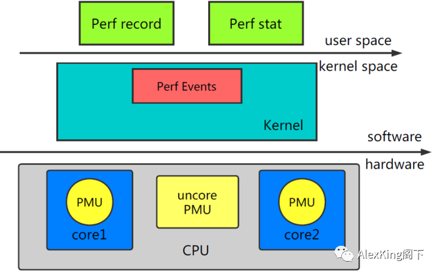
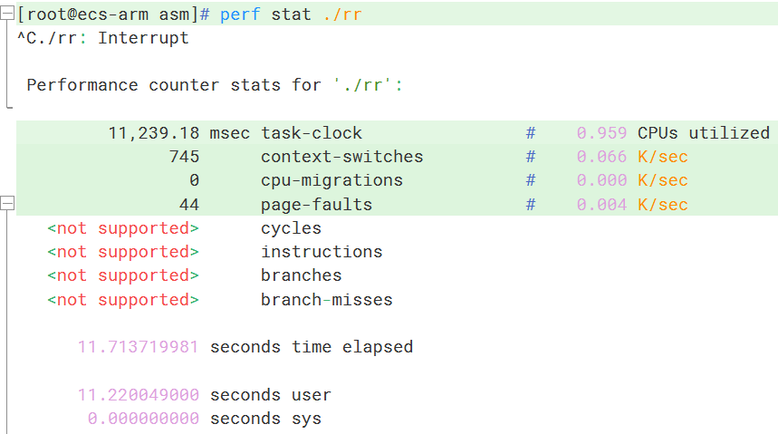
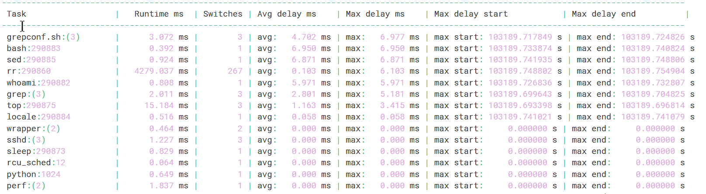
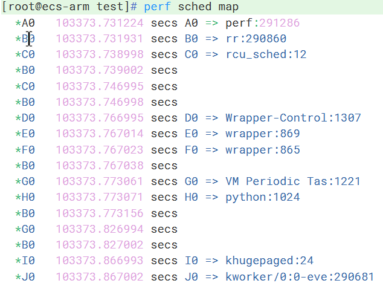
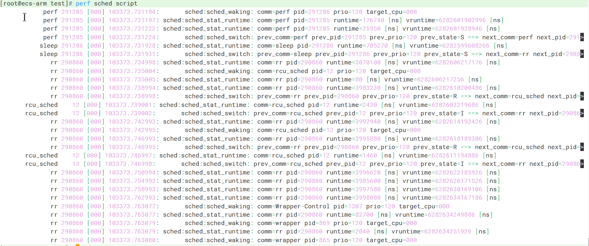
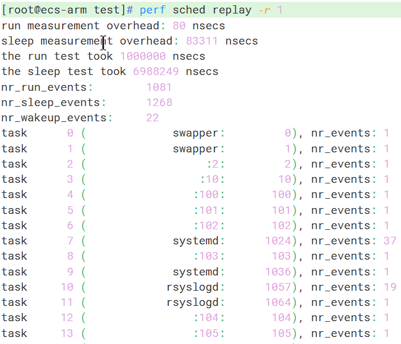
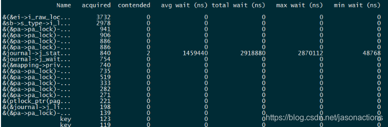
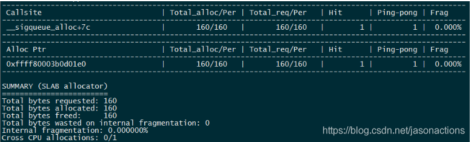
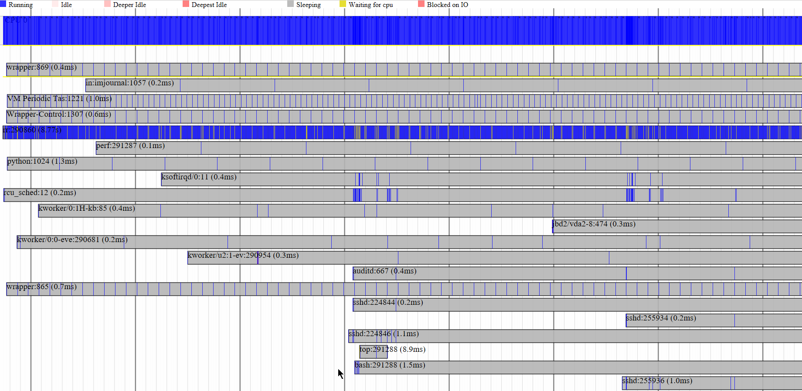

# Linux perf 使用

## 1、命令简介
| 命令           | 说明                                                         | 备注                                          |
| -------------- | ------------------------------------------------------------ | --------------------------------------------- |
| perf top       | 实时显示热点函数，实时了解动态的性能情况                     | 后文详细介绍                                  |
| perf record    | 持某段时间内热点函数采集                                     | 数据保存到perf.data中，随后用perf report 分析 |
| perf annotate  | annotate配合代码进行定位输出                                 | 通常 perf record -> report -> annotate        |
| perf probe     | 提供某个函数作为断点                                         | 后文介绍                                      |
| perf list      | 显示支持的事件类型，比如cache miss、TLB miss。               | 后文介绍                                      |
| perf bench     | 为benchmark工具的通用框架，<br>用来测试系统常见的性能指标    | perf bench all 对系统性能摸底                 |
| perf stat      | 统计性能信息                                                 | 后文详细介绍                                  |
| perf kmem      | 针对slab子系统性能分析                                       | 后文介绍                                      |
| perf kvm       | 针对kvm虚拟化分析                                            |                                               |
| perf lock      | 分析锁性能                                                   | 后文介绍                                      |
| perf mem       | 分析内存slab性能                                             |                                               |
| perf sched     | 分析内核调度器性能                                           | 后文详细介绍                                  |
| perf trace     | 记录系统调用轨迹                                             | 后文介绍                                      |
| perf timechart | 灵感来源于 bootchart。<br>采用“简单”的图形“一目了然”地揭示问题所在 |                                               |
| perf script    | perl 和 python 解析器嵌入到 perf 程序中，<br>从而使得 perf 能够进一步进行处理 | 强大的扩展能力                                |

- ##### perf依赖事件进行统计，这里的事件是通过采样机制，并不是clock级别的统计

- ##### 针对性性能检查工具：如针对锁的 **lock**;针对调度的**sched**;针对slab分配器性能**kmem**;自定义检查点 **probe**

- ##### 使用**yum install perf-debuginfo**安装的Perf符号表只能解析动态库的符号，无法解析Perf编译时出现的静态库（例如libbfd.a）的符号。因此使用**perf top**采集数据时会出现无法解析的静态库相关的符号

- ##### 除**perf top**、**perf annotate**等本身就具有显示功能的命令外，其他的数据都是用**perf report**命令来展示。
- ##### 对非系统路径的ko进行探测和收集探点时，**perf probe**和**perf record**都必须指定正确的绝对路径。
- ##### 不建议使用**timeout**命令方式停止Perf，例如**timeout -k 9 5 perf top**。Perf通过**timeout**命令退出有core dump风险。
- ##### Perf工具需要root权限。root用户具有系统最高权限，在使用root用户进行操作时，请严格按照操作指导进行操作，避免因为其他操作造成系统管理及安全风险
- ##### perf stat 提示 cycles not supported，VmWare虚拟机配置更改：勾选“虚拟化CPU性能计数器”，重启虚拟机
- ##### euler 安装 perf，推荐挂载源直接 yum install -y perf
## 2、参考链接
### 本文图与文字主要来源于：
  - [Perf的原理、编译以及使用](https://blog.csdn.net/u013983194/article/details/112209853)
  - [perf的基本使用方法](https://blog.csdn.net/jasonactions/article/details/109332167)
  - [Nginx应用调优案例](https://www.voycn.com/article/huaweiyunjishufenxiang-nginxyingyongdiaoyouanli)

## 3、perf 检测原理
- #### 利用 PMU、tracepoint和内核中的计数器进行性能统计
  
  - 


## 4、perf record 与 perf report

- #### eg. perf record -F 99 -p 12345 -g -sleep 30
- #### -F 99 表示每秒 99 次采样，-p 12345 是进程号，-g 表示记录调用栈，sleep 30 持续 30 秒
- #### 生成火焰图

  - perf record 记录采样数据
  - perf script -i perf.data &> perf.unfold       # 解析record的数据
  - stackcollapse-perf.pl perf.unfold &> perf.folded    # 将 perf.unfold 中的符号进行折叠
  - flamegraph.pl perf.folded > perf.svg        # 生成 svg 图
  - x 轴表示抽样数，越宽表示抽到次数多，执行时间长。但 x 轴不代表时间，而是所有调用栈合并后，按字符顺序排列的
  - y 轴表示调用栈，每一层是一个函数。调用栈越深，火焰越高，顶部是正在执行的函数，下方都是父函数
  - 火焰图主要看顶层的哪个函数看度最大，如果有“平顶”，表示该函数可能存在性能问题
## 5、perf annotate

- #### 代码指令级解析record文件精确定位

  - ##### 使用调试信息-g编译的文件能够显示汇编和本身源码信息。 

  - ##### 注意， annotate命令并不能够解析内核image中的符号，必须要传递未压缩的内核image给annotate才能正常的解析内核符号，比如：perf annotate -k /tmp/vmlinux -d symbol
```shell
# perf annotate 常用选项，perf annotate -h 查看所有
-C, --cpu <cpu>       list of cpus to profile  // 指定某个CPU事件
-d, --dsos <dso[,dso...]> only consider symbols in these dsos // 只解析指定文件中符号
-k, --vmlinux <file>  vmlinux pathname // 指定内核文件
-m, --modules         load module symbols - WARNING: use only with -k and LIVE kernel
-P, --full-paths      Don't shorten the displayed pathnames
-s, --symbol <symbol> symbol to annotate // 指定符号定位
```
  - #### 举例，摘自网络

```c
#include <stdio.h>
#include <time.h>
void func_a() {
   unsigned int num = 1;
   for (int i = 0; i < 10000000; i++) {
      num *= 2;
      num = 1;
   }
}
void func_b() {
   unsigned int num = 1;
   for (int i = 0; i < 10000000; i++) {
      num <<= 1;
      num = 1;
   }
}
int main() {
   func_a();
   func_b();
   return 0;
}
```
```shell
# 编译，统计，查看
gcc -g -O0 test.c
perf record -a -g ./a.out
perf annotate
```
```shell
# perf record 结果
Samples: 73  of event 'cpu-clock', Event count (approx.): 18250000       
  Children      Self  Command  Shared Object      Symbol    
+   97.26%     0.00%  a.out    a.out              [.] main 
+   97.26%     0.00%  a.out    libc-2.19.so       [.] __libc_start_main 
+   49.32%    49.32%  a.out    a.out              [.] func_a 
+   47.95%    47.95%  a.out    a.out              [.] func_b 
+    1.37%     1.37%  perf     [kernel.kallsyms]  [k] finish_task_switch  
+    1.37%     0.00%  a.out    ld-2.19.so         [.] dl_main 
```
```shell
# perf annotate 结果
func_a  /home/code/a.out           
       │    void func_a() {
       │      push   %rbp
       │      mov    %rsp,%rbp
       │       unsigned int num = 1;
       │      movl   $0x1,-0x8(%rbp)
       │       int i;
       │       for (i = 0;i < 10000000; i++) {
       │      movl   $0x0,-0x4(%rbp)
       │    ↓ jmp    22
       │          num *= 2;
 11.11 │14:┌─→shll   -0x8(%rbp)
       │   │      num = 1;
       │   │  movl   $0x1,-0x8(%rbp)
       │   │#include <stdio.h>
       │   │#include <time.h>
       │   │void func_a() {
       │   │   unsigned int num = 1;
       │   │   int i;
       │   │   for (i = 0;i < 10000000; i++) {
  5.56 │   │  addl   $0x1,-0x4(%rbp)
 33.33 │22:│  cmpl   $0x98967f,-0x4(%rbp)
 50.00 │   └──jle    14
       │          num *= 2;
       │          num = 1;
       │       }
       │    }
       │      pop    %rbp
       │    ← retq
```

## 6、perf list
- #### 列出所有能触发 perf 采样点的事件，主要分为三类：

  - Hardware Event 是由 PMU 硬件产生的事件，比如 cache 命中，L1 cache miss，指定cycle数，在特定的条件下探测性能事件是否发生以及发生的次数
  - Software Event 是内核软件产生的事件，分布在各个功能模块中，统计和操作系统相关性能事件，比如进程切换，tick 数，上下文切换、缺页例外次数等
  - Tracepoint event 是内核中的静态 tracepoint 所触发的事件，这些tracepoint用来判断程序运行期间内核的行为细节。比如slab分配器的分配次数等。
  - [perf list.txt](./perf_list.txt)

## 7、perf stat



| 默认指标           | 说明                                                         |
| ------------------ | ------------------------------------------------------------ |
| Task-clock (msecs) | CPU 利用率，任务真正占用的处理器时间，该值高，说明程序的多数时间花费在 CPU 计算上而非 IO<br>（CPU占用率 = task-clock / time elapsed） |
| Context-switches   | 进程（上下文）切换次数，记录了程序运行过程中发生了多少次进程切换，频繁的进程切换是应该避免的 |
| Cache-misses       | 程序运行过程中总体的 cache 利用情况，如果该值过高，说明程序的 cache 利用不好 |
| CPU-migrations     | 处理器迁移次数，即被调度器从一个 CPU 转移到另外一个 CPU 上运行。<br>为了维持多处理器负载均衡，特定条件下会将某个任务迁移到另一个CPU |
| Cycles             | 消耗的处理器周期数，一条机器指令可能需要多个 cycles          |
| page-faults        | 缺页异常的次数。当应用程序请求的页面尚未建立、请求的页面不在内存中，或者请求的页面虽然在内存中，但物理地址和虚拟地址的映射关系尚未建立时，都会触发一次缺页异常。另外TLB不命中，页面访问权限不匹配等情况也会触发缺页异常。 |
| Instructions       | 执行了多少条指令。IPC为平均每个cpu cycle执行了多少条指令。   |
| IPC                | 是 Instructions/Cycles 的比值，该值越大越好，说明程序充分利用了处理器的特性 |
| Cache-references   | cache 命中的次数                                             |
| Cache-misses       | cache 失效的次数                                             |
| branches           | 遇到的分支指令数。branch-misses是预测错误的分支指令数。      |
| 指定 -e            | 通过指定 -e 选项，可以改变 perf stat 的缺省事件，如 perf stat -e cpu-clock -g ./rr <br>使用 tracepoint 的基本需求是对内核的运行时行为的关心，eg. perf stat -e raw_syscalls:sys_enter ls |
| cmd                | perf stat cmd 执行 cmd，结束后会输出各类事件的统计           |

```shell
# perf stat 常用选项，perf stat -h 查看全部
-a, --all-cpus        system-wide collection from all CPUs //全部cpu统计
-C, --cpu <cpu>       list of cpus to monitor in system-wide // 指定某个CPU事件
-d, --detailed        detailed run - start a lot of events //打印更详细信息
-e, --event <event>   event selector. use 'perf list' to list available events //指定性能事件 多个用，分
-I, --interval-print <n> print counts at regular interval in ms (>= 10) // 每隔n毫秒打印一次
-p, --pid <pid>       stat events on existing process id // 指定某个pid的进程
-r, --repeat <n>      repeat command and print average + stddev (max: 100, forever: 0) //重复运行
-t, --tid <tid>       stat events on existing thread id // 指定某个tid的线程
```

## 8、perf top

- #### perf top工具的使用类似linux的top命令，实时的输出函数采样按某一统计事件的排序结果，默认事件为是cycles（消耗的处理器周期数），默认按降序排序；

- #### perf top会统计全部用户态和内核态的函数，默认是全部CPU，也可以指定某个CPU监控器。
```shell
# perf top 常用选项，perf top -h 查看全部
-a, --all-cpus        system-wide collection from all CPUs //全部cpu统计
-c, --count <n>       event period to sample // 指定采样周期
-C, --cpu <cpu>       list of cpus to monitor // 指定某个CPU事件
-e, --event <event>   event selector. use 'perf list' to list available events // 指定事件
-K, --hide_kernel_symbols hide kernel symbols // 隐藏内核函数
-U, --hide_user_symbols hide user symbols // 隐藏用户态函数
-p, --pid <pid>       profile events on existing process id // 仅分析目标进程及其创建的线程
-t, --tid <tid>       profile events on existing thread id // 仅分析目标线程
-g              	  enables call-graph recording and display // 展示调用关系（通过光标上下移动，enter展开）
```

## 9、perf probe

- #### 在想查看的地方插入动态检测点

- ```shell
  # e.g. 利用 probe 命令在内核函数 schedule() 的第 12 行处加入了一个动态 probe 点，和 tracepoint 的功能一样，内核一旦运行到该 probe 点时，便会通知 perf。可以理解为动态增加了一个新的 tracepoint
  perf probe schedule:12 cpu
  # cloud 机器无法查看，kernel invalid elf file
  ```

## 10、perf sched

- #### perf sched提供了许多工具来分析内核CPU调度器的行为。你可以用它来识别和量化调度器延迟的问题
- #### (1)  进程时延，perf sched latency
```shell
perf sched record sleep 10
perf sched latency --sort max
```

| 列            | 说明                                                         |
| ------------- | ------------------------------------------------------------ |
| Task          | 进程的名字和 pid                                             |
| Runtime       | 实际运行时间                                                 |
| Switches      | 进程切换的次数                                               |
| Average delay | 平均的调度延迟。调度延迟，                                   |
| Maximum delay | 最大延迟。这里最值得人们关注的是 Maximum delay，一般从这里可以看到对交互性影响最大的特性；<br>如果调度延迟比较大，那么用户就会感受到视频或者音频断断续续的 |



- #### (2) 所有CPU和上下文切换事件，perf sched map
```shell
perf sched record sleep 10
perf sched map
```

- ##### 	每个CPU一行，星号表示调度事件正在发生的CPU

- ##### Map 的好处在于提供了一个的总的视图，将成百上千的调度事件进行总结，显示了系统任务在 CPU 之间的分布，假如有不好的调度迁移，比如一个任务没有被及时迁移到 idle 的 CPU 却被迁移到其他忙碌的 CPU，类似这种调度器的问题可以从 map 的报告中一眼看出来（暂时不知道如何一眼看出，截图是只有 cpu 0 的 arm 云计算机器）。



- #### (3) 显示调度相关的事件，perf sched script
```shell
perf sched record sleep 10
perf sched script
```

- ##### 可以查看schedule的trace

 

- #### (4) 重放 perf.data 文件中记录的调度场景，perf sched replay

```shell
perf sched replay -r 1
```
- ##### 采集记录的调度器事件，通过生成具有类似运行时间和上下文切换的线程来模拟工作负载
  

## 11、perf lock

- #### 锁是内核同步的方法，一旦加了锁，其他准备加锁的内核执行路径就必须等待，降低了并行。因此对于锁进行专门分析应该是调优的一项重要工作

  - ##### 摘了网络图片，机器在调测时，报错了，可能是内核不兼容？

  - tracepoint lock:lock_acquire is not enabled. Are CONFIG_LOCKDEP and CONFIG_LOCK_STAT enabled?
```shell
perf lock record dd if=/dev/testb_a of=/dev/null
perf lock report
```

| 列         | 说明                                                         |
| ---------- | ------------------------------------------------------------ |
| Name       | 锁的名字，比如 md->map_lock，即定义在 dm.c 结构 mapped_device 中的读写锁 |
| acquired   | 该锁被直接获得的次数，即没有其他内核路径拥有该锁的情况下得到该锁的次数 |
| contended  | 冲突的次数，即在准备获得该锁的时候已经被其他人所拥有的情况的出现次数 |
| total wait | 为了获得该锁，总共的等待时间                                 |
| max wait   | 为了获得该锁，最大的等待时间                                 |
| min wait   | 为了获得该锁，最小的等待时间                                 |



## 12、perf kmem

- #### 专门收集内核 slab 分配器的相关事件。比如内存分配，释放等。可以用来研究程序在哪里分配了大量内存，或者在什么地方产生碎片之类的和内存管理相关的问题（简略介绍，未实测，网络图）

- 

- #### 该报告有三个部分：

 - ##### 1. 根据 Callsite 显示的部分

    - ##### Callsite： 即内核代码中调用 kmalloc 和 kfree 的地方。比如上图中的函数 __sigqueue_alloc__

    - ##### Hit：表示调用kmalloc的次数，为 1表示该函数在 record 期间一共调用了 kmalloc 一次__
      
    - ##### Total_alloc/Per ：显示为 160/160，第一个值 160表示函数 __sigqueue_alloc总共分配的内存大小，Per 表示平均值。
      
    - ##### Frag ：内部碎片的比例。虽然相对于 Buddy System，Slab 正是要解决内部碎片问题，但 slab 依然存在内部碎片，比如一个 cache 的大小为 1024，但需要分配的数据结构大小为 1022，那么有 2 个字节成为碎片。Frag 即碎片的比例。

    - ##### Ping-pong ：是一种现象，在多 CPU 系统中，多个 CPU 共享的内存会出现”乒乓现象”。一个 CPU 分配内存，其他 CPU 可能访问该内存对象，也可能最终由另外一个 CPU 释放该内存对象。而在多 CPU 系统中，L1 cache 是 per CPU 的，CPU2 修改了内存，那么其他的 CPU 的 cache 都必须更新，这对于性能是一个损失。Perf kmem 在 kfree 事件中判断 CPU 号，如果和 kmalloc 时的不同，则视为一次 ping-pong，理想的情况下 ping-pone 越小越好。Ibm developerworks 上有一篇讲述 oprofile 的文章，其中关于 cache 的调优可以作为很好的参考资料。

  - ##### 2. 根据被调用地点显示部分

  - ##### 3. 汇总数据

     - ##### 显示总的分配的内存和碎片情况，Cross CPU allocation 即 ping-pong 的汇总
  - ##### 4. 注：Perf kmem 和 perf lock 实际上都是 perf tracepoint 的特例，您也完全可以用 Perf record > – e kmem:* 或者 perf record – e lock:*> 来完成同样的功能。但重要的是，这些工具在内部对原始数据进行了汇总和分析，因而能够产生信息更加明确更加有用的统计报表。

## 13、perf timechart

- #### 生成 perf.data 之后，perf timechart 即可得到 svg 图

- ##### 最上面一行是图例,蓝色表示忙碌，红色表示 idle，灰色表示等待，等等。接下来是 per-cpu 信息,再下面是 per-process 信息.Timechart 可以显示更详细的信息，上图实际上是一个矢量图形 SVG 格式，用 SVG viewer 的放大功能，我们可以将该图的细节部分放大，timechart 的设计理念叫做”infinitely zoomable”。下图是 cpu 0 占满的进程运行状态。

- 


## n、附录

### 1、perf性能需要了解背景知识
- #### （1）cache流水线
- #### （2）超标量体系结构
- #### （3）乱序执行
- #### （4）分支预测
- #### （5）PMU计数
- #### （6）tracepoint

  - tracepoints是散落在内核源码中的一些hook，它们可以在特定的代码被执行到时触发，这一特定可以被各种trace/debug工具所使用。 perf将tracepoint产生的时间记录下来，生成报告，通过分析这些报告，可以了解程序运行期间内核的各种细节，对性能症状做出准确的诊断。