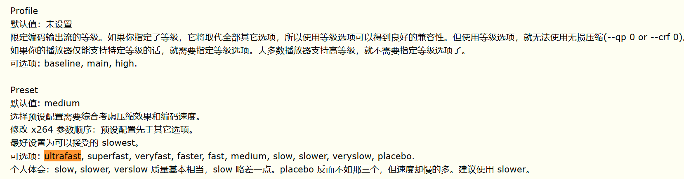

# X264代码走读

# 2024-06-03 Lighthawk@126.com

## 1、example.c 从 main() 开始

### （1）基础参数初始化 x264_param_default_preset( &param, "medium", NULL )

- 全量初始化 x264_param_default
- 根据参数2（效果 ultrafast/superfast/veryfast/faster/fast/medium/slow/slower/veryslow/placebo），更新相关参数 param_apply_preset；默认 medium
  - static const char * const x264_preset_names[]
- 根据参数3（其他 film/animation/grain/stillimage/psnr/ssim/fastdecode/zerolatency/touhou），微调其他参数 param_apply_tune；默认NULL，不生效
  - static const char * const x264_tune_names[]
 - 在 x264.h 中能查到这几个常量的注释,很有趣,指出了戏剧性(dramatically)的效率差异: Ultrafast is a full 100 times faster than placebo! 
 - 参数2 present 和参数3 tune 任一都可以为 NULL
 - 参数3 tune 如果存在多个选项,可以用分隔符 ",./-+" 隔开,但是部分参数只能取其一,有这些: film, animation, grain, stillimage, psnr, and ssim
### （2）编码等级初始化 x264_param_apply_profile( &param, "high" )

- 将 profile 从字符串转为 enum profile_e

  - static const char * const x264_profile_names[]

- 再根据参数 profile 值和基础参数,校验当前参数是否合法

- 校验的比较简略粗暴吧,由于在 preset 后面设置,部分参数会以 profile 为准,覆盖 preset 设置

- ```c++
  enum profile_e
  {
      PROFILE_BASELINE = 66,
      PROFILE_MAIN     = 77,
      PROFILE_HIGH    = 100,
      PROFILE_HIGH10  = 110,
      PROFILE_HIGH422 = 122,
      PROFILE_HIGH444_PREDICTIVE = 244,
  };
  ```
- 
- [(转)x264参数中文详解（X264 Settings） - lihaiping - 博客园 (cnblogs.com)](https://www.cnblogs.com/lihaiping/p/4037470.html)
### （3）图像内存分配 x264_picture_alloc( &pic, param.i_csp, param.i_width, param.i_height )

- 主要为 x264_picture_t pic 初始化为 0,i_csp 指定了像素排列规则(如I420/NV12等)

- 根据最后3个入参,计算当前大小帧编码需要的内存,通过 void *x264_malloc( int64_t i_size ) 申请后,给 pic->img.plane[0],img.plane[1]和img.plane[2]内存是紧接在 [0] 之后的

- 留意下 stride 的计算,有助于进一步对图像像素分布理解 -> TODO

  - int stride = (((int64_t)i_width * csp_tab[csp].width_fix8[i]) >> 8) * depth_factor;

  - i -> [0, 2]

  - 与 csp 密切相关,写死的 width_fix8 是 x264_csp_tab_t 的第二个元素

  - ```c++
    typedef struct
        {
            int planes;
            int width_fix8[3];
            int height_fix8[3];
        } x264_csp_tab_t;
    
        static const x264_csp_tab_t csp_tab[] =
        {
            [X264_CSP_I400] = { 1, { 256*1 },               { 256*1 }               },
            [X264_CSP_I420] = { 3, { 256*1, 256/2, 256/2 }, { 256*1, 256/2, 256/2 } },
            [X264_CSP_YV12] = { 3, { 256*1, 256/2, 256/2 }, { 256*1, 256/2, 256/2 } },
            [X264_CSP_NV12] = { 2, { 256*1, 256*1 },        { 256*1, 256/2 },       },
            [X264_CSP_NV21] = { 2, { 256*1, 256*1 },        { 256*1, 256/2 },       },
            [X264_CSP_I422] = { 3, { 256*1, 256/2, 256/2 }, { 256*1, 256*1, 256*1 } },
            [X264_CSP_YV16] = { 3, { 256*1, 256/2, 256/2 }, { 256*1, 256*1, 256*1 } },
            [X264_CSP_NV16] = { 2, { 256*1, 256*1 },        { 256*1, 256*1 },       },
            [X264_CSP_YUYV] = { 1, { 256*2 },               { 256*1 },              },
            [X264_CSP_UYVY] = { 1, { 256*2 },               { 256*1 },              },
            [X264_CSP_I444] = { 3, { 256*1, 256*1, 256*1 }, { 256*1, 256*1, 256*1 } },
            [X264_CSP_YV24] = { 3, { 256*1, 256*1, 256*1 }, { 256*1, 256*1, 256*1 } },
            [X264_CSP_BGR]  = { 1, { 256*3 },               { 256*1 },              },
            [X264_CSP_BGRA] = { 1, { 256*4 },               { 256*1 },              },
            [X264_CSP_RGB]  = { 1, { 256*3 },               { 256*1 },              },
        };
    ```

- x264_malloc 应该是做了 16bit 对齐,为了防止TLB missing,做了特殊处理 -> 这里待仔细读 -> TODO

- ```c++
  void *x264_malloc( int64_t i_size )
  {
  #define HUGE_PAGE_SIZE 2*1024*1024
  #define HUGE_PAGE_THRESHOLD HUGE_PAGE_SIZE*7/8 /* FIXME: Is this optimal? */
      if( i_size < 0 || (uint64_t)i_size > (SIZE_MAX - HUGE_PAGE_SIZE) /*|| (uint64_t)i_size > (SIZE_MAX - NATIVE_ALIGN - sizeof(void **))*/ )
      {
          x264_log_internal( X264_LOG_ERROR, "invalid size of malloc: %"PRId64"\n", i_size );
          return NULL;
      }
      uint8_t *align_buf = NULL;
  #if HAVE_MALLOC_H
  #if HAVE_THP
      /* Attempt to allocate huge pages to reduce TLB misses. */
      if( i_size >= HUGE_PAGE_THRESHOLD )
      {
          align_buf = memalign( HUGE_PAGE_SIZE, i_size );
          if( align_buf )
          {
              /* Round up to the next huge page boundary if we are close enough. */
              size_t madv_size = (i_size + HUGE_PAGE_SIZE - HUGE_PAGE_THRESHOLD) & ~(HUGE_PAGE_SIZE-1);
              madvise( align_buf, madv_size, MADV_HUGEPAGE );
          }
      }
      else
  #endif
          align_buf = memalign( NATIVE_ALIGN, i_size );
  #else
      uint8_t *buf = malloc( i_size + (NATIVE_ALIGN-1) + sizeof(void **) );
      if( buf )
      {
          align_buf = buf + (NATIVE_ALIGN-1) + sizeof(void **);
          align_buf -= (intptr_t) align_buf & (NATIVE_ALIGN-1);
          *( (void **) ( align_buf - sizeof(void **) ) ) = buf;
      }
  #endif
      if( !align_buf )
          x264_log_internal( X264_LOG_ERROR, "malloc of size %"PRId64" failed\n", i_size );
      return align_buf;
  #undef HUGE_PAGE_SIZE
  #undef HUGE_PAGE_THRESHOLD
  }
  ```

- 重点看下 x264_picture_t 这个结构体，尤其注意 x264_param_t，x264_image_properties_t，前者是编码器默认配置（如果为NULL，默认使用前一帧参数；部分参数需要新GOP生效，如aspect ratio；因此该参数更新需要一个强制IDR），后者是可选&每帧可调的

- 这样看的话，编码器参数变更有三个时间点，除去新的GOP，新的frame，还有创建编码器的时候（?）

### （4）给编码句柄h申请内存，拷贝编码参数到h中 x264_encoder_open( &param )

- static int validate_parameters( x264_t *h, int b_open ) 参数合法性检查

  - CPU指令集探测

  - 线程数自动分配（如果配置了 X264_THREADS_AUTO，最大不超过 行数/2）与初始化

  - 线程锁的初始化

  - 这里有分数化简动作，也有个 bool b_user_fps，留意下这个的作用，看是否用来做码控 -> TODO

  - 较多的汇编回调初始化，c语言模板写法，值得参考！
  
    - ```c++
      x264_predict_16x16_init( h->param.cpu, h->predict_16x16 );
      x264_predict_8x8c_init( h->param.cpu, h->predict_8x8c );
      x264_predict_8x16c_init( h->param.cpu, h->predict_8x16c );
      x264_predict_8x8_init( h->param.cpu, h->predict_8x8, &h->predict_8x8_filter );
      x264_predict_4x4_init( h->param.cpu, h->predict_4x4 );
      x264_pixel_init( h->param.cpu, &h->pixf );
      x264_dct_init( h->param.cpu, &h->dctf );
      x264_zigzag_init( h->param.cpu, &h->zigzagf_progressive, &h->zigzagf_interlaced );
      memcpy( &h->zigzagf, PARAM_INTERLACED ? &h->zigzagf_interlaced : &h->zigzagf_progressive, sizeof(h->zigzagf) );
      x264_mc_init( h->param.cpu, &h->mc, h->param.b_cpu_independent );
      x264_quant_init( h, h->param.cpu, &h->quantf );
      x264_deblock_init( h->param.cpu, &h->loopf, PARAM_INTERLACED );
      x264_bitstream_init( h->param.cpu, &h->bsf );
      if( h->param.b_cabac )
          x264_cabac_init( h );
      else
          x264_cavlc_init( h );
      
      mbcmp_init( h );
      chroma_dsp_init( h );
      ```
  
  - 部分位运算做了强制内联，__forceinline
  
  - i_sync_lookahead lookahead 在此用于初始化，了解下这个技术 -> TODO
  
  - 输出码流内存初始化：码流指针 out.p_bitstream, 码流长度 out.i_bitstream

### （5）每一帧 for( ;; i_frame++ ) -> fread -> x264_encoder_encode -> fwrite -> TODO

- 因为太大了，后面单独放一个大章节看

### （6）lookahead：while -> x264_encoder_delayed_frames( h ) -> x264_encoder_encode -> write

- 延迟帧？-> TODO

### （7）x264_encoder_close( h ); -> TODO

### （8）x264_picture_clean( &pic ); -> TODO

### （9）x264中的 opencl

## 2、x264_encoder_encode 

## 3、scenecut 场景检测入口


