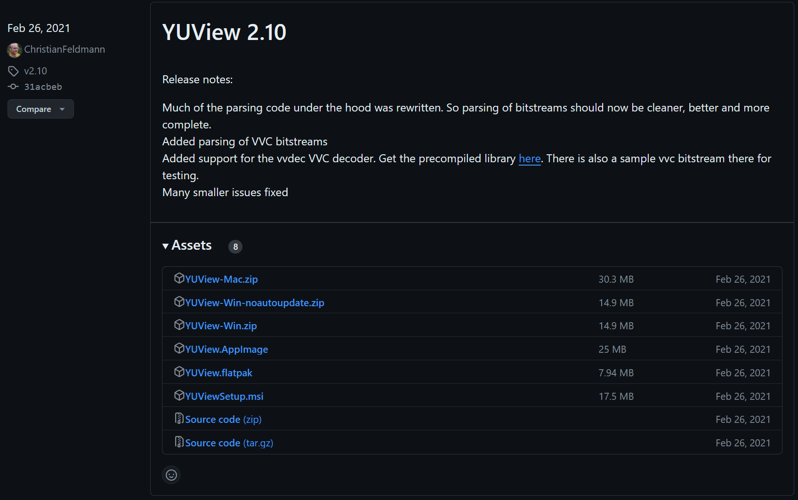
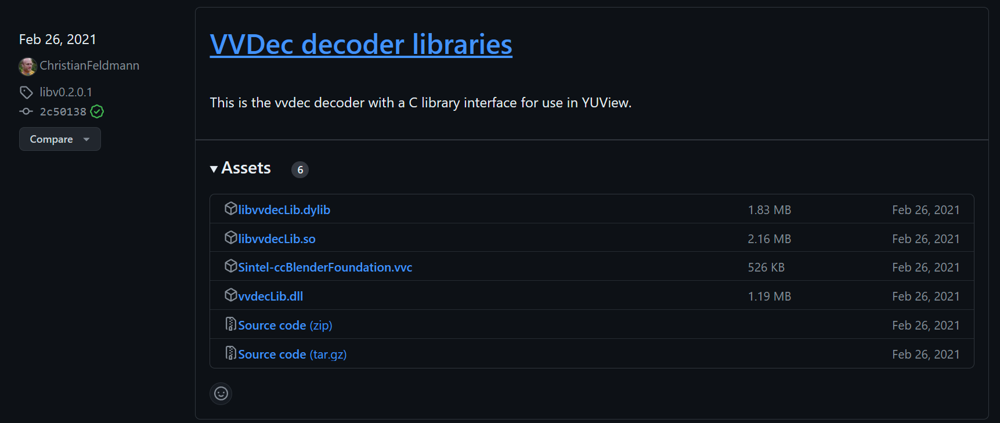

## YUVView
```shell
https://github.com/IENT/YUView/releases
# 需要下载 2021年2月26日的 2.10，配套同期的 vvcdecLib 使用
# https://github.com/ChristianFeldmann/vvdec/releases
# P.S. YUView 2.10 和 VVDec decoder libraries 是同一个作者，应该是中国人
# 原生的 vvdec：https://github.com/fraunhoferhhi/vvdec
# 如果想用新版本，就自己编译 vvdec

# 但非常奇怪的，这个软件没法正确读入 h264 ?
```



